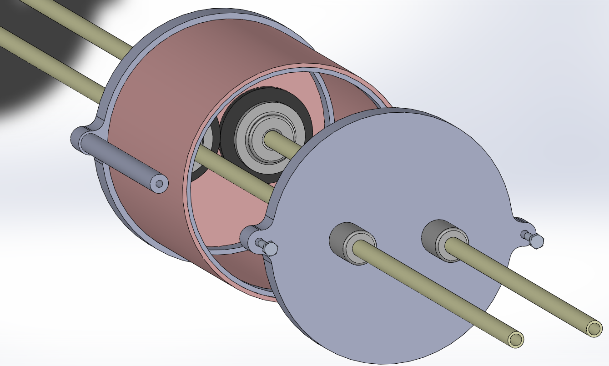
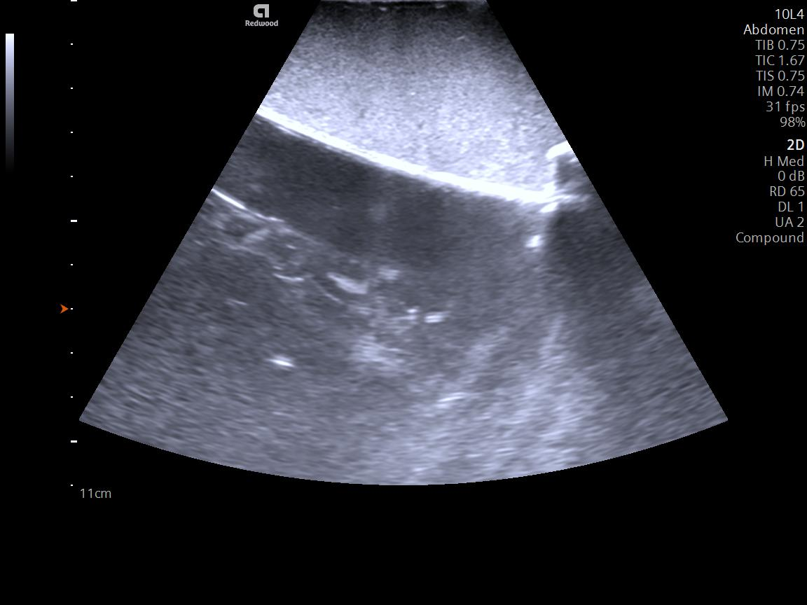
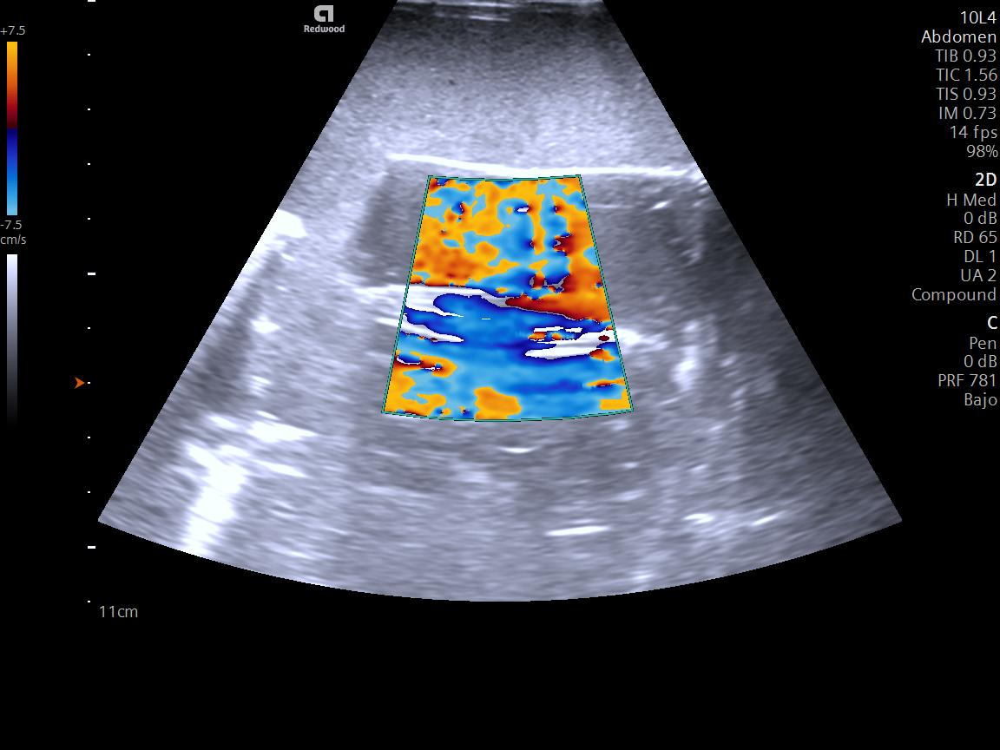
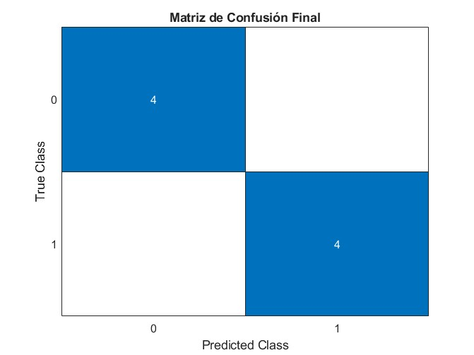
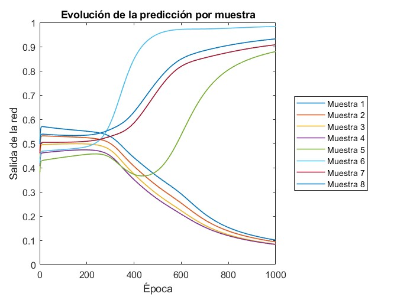

# 🩺 Vascular Ultrasound Phantoms Project 🏥  

  
  
  
  

## 📌 Overview  
  
*⚡ Phantom*  

Development of **vascular phantoms** simulating stenosis and aneurysms using **clinical ultrasound (B-mode/Doppler)** to assess hemodynamic changes. Created at **Tecnológico de Monterrey**, this project focuses on **accessible educational tools** for medical imaging training.  

---

## 📑 Table of Contents  
1. [✨ Features](#-features)  
2. [⚙️ How It Works](#️-how-it-works)  
3. [🎯 Purpose](#-purpose)  
4. [🧠 Neural Network](#-neural-network)  
5. [📊 Results](#-results)  
6. [🏥 Real-World Applications](#-real-world-applications)  
7. [📜 License](#-license)  

---

## ✨ Features  
- **🖨️ 3D-Printed Vascular Phantoms** (SOLIDWORKS designs)  
- **📡 Ultrasound Image Acquisition** (DICOM format)  
- **🔄 Hemodynamic Simulation** (stenosis/aneurysms)  
- **🔍 MATLAB-Based Image Processing**  
- **🤖 Neural Network for Pathology Classification**  
- **🌊 Doppler Flow Analysis**  

---

## ⚙️ How It Works  
1. **🎨 Design**: Vascular structures modeled in **SOLIDWORKS**  
2. **🛠️ Fabrication**: 3D printing of phantom components  
3. **📸 Imaging**: Ultrasound scanning (B-mode/Doppler)  
4. **🔬 Analysis**: MATLAB processing of DICOM images  
5. **🤖 Classification**: Neural network detects pathologies  

---

## 🎯 Purpose  
Provides **accessible educational tools** for:  
- **👨‍⚕️ Ultrasound Imaging Training**  
- **🩺 Hemodynamic Pattern Recognition**  
- **⚕️ Medical Device Testing**  
- **🔬 Biomedical Engineering Education**  

---

## 🧠 Neural Network  
**Multilayer Perceptron (MLP)** for vascular pathology detection:  
- **📥 Input**: Normalized area & mean intensity from DICOM  
- **⚡ Architecture**: 2 input → 5 hidden → 1 output neurons  
- **🎓 Training**: Backpropagation (α=0.5, 1000 epochs)  
- **🔎 Function**: Binary classification of stenosis/healthy tissue  

---

## 📊 Results  
  
*🔍 Ultrasound visualization*  

  
*🌊 Doppler analysis showing turbulent flow patterns*  

  
*🧠 Confusion matrix of pathology classification*  

  
*📈 Evolution of Sample Prediction*  

---

## 🏥 Real-World Applications  
- **🏫 Medical Imaging Training Programs**  
- **💡 Ultrasound Device Validation**  
- **🔧 Biomedical Engineering Education**  
- **🤖 Diagnostic Algorithm Development**  
- **🌍 Low-Cost Simulation for Resource-Limited Institutions**  

---

## 📜 License  
Distributed under the **MIT License**. See [`LICENSE`](LICENSE) for details.  

---

### 🗂️ **Repository Structure Key**  
| Folder | Contents |  
|--------|----------|  
| **`/SOLIDWORKS/`** | 3D phantom designs 🖥️ |  
| **`/MATLAB/`** | Image processing & neural network code 🤖 |  
| **`/images/`** | DICOM ultrasound results 📸 |  
| **`/water-pump/`** | Flow control system documentation ⚙️ |  

#### Participantes
1. JMVL
2. CCA
3. CGN
4. PMQM
5. MMVN
6. SICG
